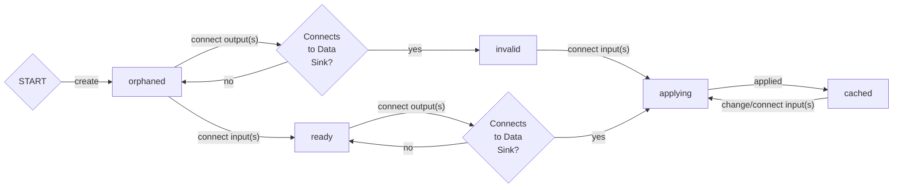
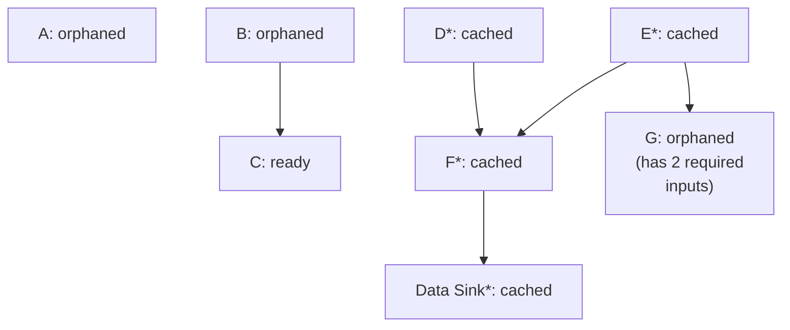

# Spice Engine
An image processor utilising node-based, composable recipes.

This project is under heavy development and things will break without warning in regular, short intervals. The code is also not necessarily (or at all) production ready, so do make sure to read and understand all of it before you use it.

Note that this README is not necessarily up-to-date with the current state of the code while the project is in development. At the moment you could call it a reflection of what recent-past-me thought the project would be in the near future.

Part of the documentation provided here can also be seen as a roadmap for future features. Eventually the more implementation-related parts will be specified in a doxygen document.

## Usage

To run the tests, you will have to install Google Test. You will most likely also have to change the path to it in CMakeLists.txt - I have not yet gotten around to properly setting up the build system (and also have a lot to learn in that regard). Once that's set up, though, there's a little script called `spice_build.sh` to save you some typing. It takes one positional argument (`Debug` or `Release`) to specify if you want a debug or a release build.

Since I wanted to play with the newest features, Spice is based on the C++17 standard and will probably not work with anything else.

For now, everything is defined in implemented in headers. This might change, but seeing that Spice uses a lot of templates, it might also stay this way or I might move the implementation into included files.

As long as things are the way they are, though, you can just include the header you want, so even if it isn't pretty, it's convenient.

## Dependencies

The following dependencies have to be installed manually:

- openimageio

Required to run the tests:

- Google Test

## Data Structures

### Recipe

A node graph. If at least one in- or output is exposed, the recipe can be referenced from another (called the parent recipe) as a node.

### Node

A filter, transform or other modification to be applied to zero or more data structures, resulting in zero or more data structures. Data flows in and out through a fixed number of in- and outputs. Some inputs might accept multiple sources (they are represented as a vector of outputs).

#### States of a node

A node may have several required and optional inputs. It cannot execute its operation if the required inputs are not supplied.

To save resources, only nodes that are part of a sub-graph that terminates in a data sink (e.g. a viewer or file output) are computed.

A node can have the following states:

- orphaned
- invalid
- ready
- applying
- cached

States can be changed as follows



Connect/create transitions can be traversed in reverse direction with the inverse action (disconnect/delete).

Thus, in the following graph, only nodes marked with an asterisk would be applied if an input above them changed.



- i/o connected
  - Clear `dag_state::computed_subtree` flag on all nodes
  - Reverse traverse from all data sinks and tag all encountered nodes `dag_state::computed_subtree`
  - Check if node receiving the input now has all necessary inputs and remove flag `dag_state::input_missing` if applicable
  - If no inputs are missing and the node is within the computed subtree, apply the operation and propagate the change through the tree by forward traversal
- i/o disconnected
  - If now-disconnected input is required by the owning node:
    - set flag `dag_state::input_missing` on the owner
    - forward traverse DAG from owner of the now-disconnected input and set `dag_state::input_missing` on all nodes that are part of this particular branch via a required input
    - clear `dag_state::computed_subtree` on all nodes
    - reverse traverse from all data sinks and set `dag_state::computed_subtree` on encountered nodes
  - Else:
    - Re-apply the operation with new (= reduced) input data and notify consumers of this node's output if the output value has changed


### Input

Potentially optional data source for a node. Specifying values for both optional and obligatory nodes can be deferred to the parent recipe. Deferring value specification does not imply the absence of a value (e.g. one might be provided for preview purposes or as a default).

### Output

Product of a node. Can be fed to an input of compatible type or exposed as the product of the recipe (thus exposing an output in the recipe's node in the parent recipe).

### Matrix\<T>

Abstract, two dimensional set of values.

### Image

A collection of aliases for specialisations of the `matrix` class.

There are various types of images, used for various purposes (mostly to distinguish between the meaning of the different channels):

```c++
using rgb_image		= matrix<pixel<3>>
using rgba_image	= matrix<pixel<4>>
using a_image			= matrix<pixel<1>>
using cmyk_image	= matrix<pixel<4>>
using cmyka_image	= matrix<pixel<5>>
```

The most used one is the `rgb_image` - Spice works in RGB space and all nodes working with an alpha channel use a seperate input of type `a_image` for it.

### Primitives

float, int, string etc...

## Node Types

*Note on in/outputs:* optional inputs are wrapped in [ square brackets ]. Unspecified obligatory inputs are automatically deferred to the parent recipe.
In/outputs wrapped in [[double square brackets]] are optional and hidden until they are relevant.

Currently unimplemented node types are set in *italic*. The planned release version is noted after the pipe "|" (some features might be missing upon release).

### Data I/O

#### *Asset | v 0.1.0*

Reads or writes a source file.

As of yet unimplemented.

##### Inputs

- Path: `string` - the path to read from or write to
- [ Source: `any` ] - the data to write to the path

##### Outputs

- [[ Data: `any` ]] - the data read from the path (if it exists)

#### *Recipe | v 0.1.0*

Loads another recipe into the current one.

As of yet unimplemented.

##### Inputs

- Recipe Inputs: `any[]` - all exposed inputs of the child recipe

##### Outputs

- Recipe Outputs: `any[]` - all exposed outputs of the child recipe

#### *Plane | v 0.1.0*

Generates a solid colour or gradient on an infinite canvas

As of yet unimplemented.

##### Inputs

- Colours: `map<point, rgba>` - colours of the plane - if the map contains exactly one element, the plane has a solid colour

##### Outputs
- Data: `image`

#### *Text | v 0.2.0*

Typesets a string in a particular font.

As of yet unimplemented.

##### Inputs

- String: `string`
- Font: `string` // TODO: check if a simple search string is enough for fontconfig
- Font size: `uint16_t`

##### Outputs
- Data: `image`

### Image Processing

#### *Blend | v 0.1.0*

Combines a stack of images into one.

As of yet unimplemented.

##### Inputs

- Images: `pair<image, matrix<float>(3,3)>[]` - the images to be blended along with their respective transforms relative to the origin of the blend

##### Outputs

- Data: `image`

#### *Blur | v 0.1.0*

As of yet unimplemented.

##### Inputs

##### Outputs
- Data: `image`

#### *Curves | v 0.2.0*

As of yet unimplemented.

##### Inputs

##### Outputs

- Data: `image`

#### *Convolution | v 0.2.0*

As of yet unimplemented.

##### Inputs

##### Outputs

- Data: `image`

#### *Bandpass | v 0.3.0*

As of yet unimplemented.

##### Inputs

##### Outputs

- Data: `image`

#### *Crop | v 0.1.0*

Sets the dimensions of the input matrix.

As of yet unimplemented.

##### Inputs

- Source: `image`
- Transform: `matrix<float>(3,3)` - size, position and rotation of the crop window relative to the source matrix

##### Outputs

- Data: `image`

### Transformation

#### *Transform | v 0.1.0*

A widget to enter transformation data. Multiple transform nodes can be chained to compound their transformations.

As of yet unimplemented.

##### Inputs

- Transform: `matrix<float>(3,3)` - position, scale and rotation

##### Outputs

- Transform: `matrix<float>(3,3)` - position, scale and rotation

## Feature Goals

These are far from being implemented. They're goals. One day, they might be features.

- Portability: given that it has a UI for it, it should run on any of the five major operating systems
- Quality: output should equal or surpass the quality achievable with high-end editing software
- Speed: it should crunch through editing 150MP images in real time on a mid-range MacBook Pro or equivalent machines (i.e. maxed out 13" version, basic 15" version from two generations back)
- Generality: it should work with as simple or as complex a processing pipeline as the user wants
- Extensibility: new filters and transformations should be addable without much effort (and preferably using a well-known plugin API like OpenFX) and run at native speed
- Pluggability: it should be trivially extensible to be usable with any plugin interface (e.g. PS, OpenFX)
